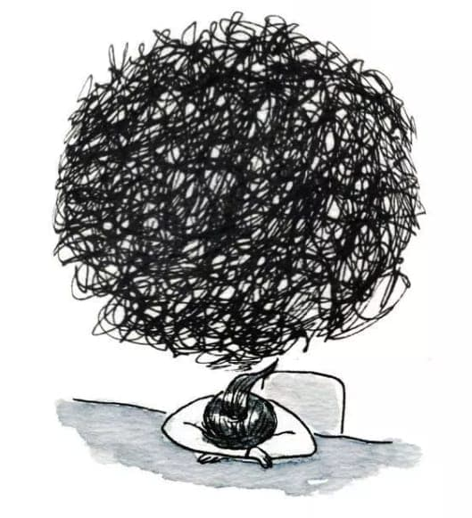

- Traducción del artículo: [On Being a Free Software Maintainer](https://feaneron.com/2019/03/28/on-being-a-free-software-maintainer/)
- Autor Original: [Georges Stavracas](https://feaneron.com/)

# Sobre ser un mantenedor de Software Libre

Es el año 2013. Estoy aprendiendo sobre un proyecto nuevo llamado
"GNOME Calendar". Interesante...

Me gustan los calendarios.

Mi niño interior dice: "¡Genial!, voy a seguir este proyecto". Los
cambios más recientes y novedosos estaban siendo realizados en el branch
ui-rework. Todos los días, aparecían algunos commits nuevos. Hacía pull,
compilaba y probaba las mejoras. Excepto por día: no había commits nuevos.
Tampoco había commits al siguiente día, ni a la semana, ni al mes, ni al
año. Estaba desilucionado. No quería que el proyecto muriera.

Como mencioné antes: Me gustan los calendarios.

Mi niño interior nuevamente dijo: "No, esto no va a suceder". Así que
cloné el repositorio, compilé, reparé bugs u envié los arreglos. El
interés del mantenedor en el proyecto se renovó. Conseguimos un ícono
nuevo, las cosas se empezaban a poner estables. Creamos un canal de
IRC nuevo (!) y lanzamos la primer versión pública de GNOME Calendar.

Pasó un año más, es el año 2015. Después de contribuir por más de
un año, Erick me nombró el nuevo mantenedor ¹ de GNOME Calendar.
Una mezcla de emociones positivas fluyeron: satisfacción por el
logro; entusiasmo por lograr la posibilidad de llevar mis ideas
al futuro de la aplicación; miedo, por el peso de la responsabilidad.

Pero diablos, ahora soy un mantenedor de software libre.

Eso fue hace 4 años. El tiempo pasó, ocurrieron cosas, se construyó
experiencia. Y la experiencia difiere de lo que originalmente esperaba.

Ser un mantenedor de software libre te pone en un sitio algo raro. Cosas
buenas vienen de ahí, cosas malas, pero también terribles y extrañas.

Naturalmente, hay una sensación de logro muy fuerte en vos cuando
logras, bueno, conseguir el liderazgo de mantenimiento en un proyecto.
Usualmente, conseguir ese logro requiere un número muy grande de
interacciones durante un periodo de tiempo muy prologando. Significa
que son alguien en quien se confía, significa que das seguridad y que
tenes las habilidades técnicas que se necesitan para hacerlo bien.

Usualmente también significa lograr vínculos más fuertes con
la comunidad. Conocer personas excelentes, que saben un montón u están
dispuestos a compartir, aconsejar y ayudar. Hay un enorme valor
humano en poder estar rodeado de personas así.

Y para aquellos que disfrutamos programar, ¡mucho mejor!. También
puede interesarte planificar entregas, codificar y hacer
revisiones de código. Vas a encontrar problemas, buscar soluciones,
pensar y diseñar tu código. Hay una multitud de problemas para resolver
en este lugar y vas a tener la chance de resolverlos independientemente
vos mismo.

Y las personas, eventualmente van a enviarte un email de
agradecimiento, o te van a invitar un café. De una forma u otra,
las personas van a encontrar la forma de llegar a vos.

Las personas realmente van a encontrar la forma de llegar a vos.

Ahora bien, el software que mantienes a veces falla. Esos fallos
podrían hacer que se pierdan los datos de alguien más. A veces alguien
puede generar una condición única dentro de tu código que vos nunca
atendiste. Esas personas se pueden enojar, poner tristes, y frustrarse ².

Y entonces, esas personas _van a encontrar_ la forma de llegar a vos.

Van a reclamarte que repares tu software, van a gritarte. A veces,
pueden cruzar la linea, e incluso van a insultarte. "¿Cómo no vas a
(usar tu tiempo libre para) arreglar este bug ultra importante que
me está afectando a mí?" o "¡Esta es una característica super básica!
¿Cómo no está implementada aún (por vos en tu tiempo libre)?!!" o
incluso "Me hiciste cambiar al Software Y, y ahora vas a necesitar
ganarme como usuario de nuevo para que vuelva".

Estas frases van a ser realidades con las que vas a tener que lidiar.

Podrías tener emociones muy particulares acerca de tu código. Tal
vez te sientas avergonzado por cosas que hiciste y haces en el
código. Después de todo, tu código tiene bugs, hay un montón de issues
pendientes de resolución en tu bug tracker y las personas se están
quejando sin parar. (Oh, y naturalmente, va a haber alguien intentando
poner su mejor esfuerzo en hacértelo notar.)

En algún punto, vas a mirar la lista completa de issues en tu
bug tracker y sentir una desesperación sutil cuando te des cuenta
que nunca vas a ser capaz de resolver todos los bugs.

Si estás dispuesto a revisar y aprobar las contribuciones de otras
personas, hay una alta probabilidad de que encuentres desafíos
disfrazados de contribuidores. Y tu revisión de código será como
una batalla intelectual entre el bien y el mal. Vas a necesitar
explicar y clarificar una y otra vez, lidiar con lógica circular
y con casi cualquier herramienta que las personas usen para ganar
batallas en lugar de mejorar su código. Eso, es increíblemente
tedioso.

Seguramente van a decirte que _necesitas crear una piel más gruesa_.
Que ignores eso, que lo dejes ir, pensar de forma positiva y no
prestar atención a toda la mierda que te tiran y por qué sos
tan negativo siendo un mantenedor.

Puede que ya no sientas la alegría de trabajar en lo que trabajas. Tal
vez tengas que cambiar a otra cosas. Puede que no lo hagas por el
sentido de responsabilidad que tienes con tu código, tu comunidad
y las personas que usan tu software.

Desafortunadamente, ser un mantenedor de software libre puede tener
un costo muy alto para tu salud emocional y psicológica.

Hace cuatro años, ciertamente no lo sabía.

1 - Y por "mantenedor" me refiero a ser el mantenedor de código
principal, no el mantenedor del paquete.

2 - Y con razón, nadie quiere perder sus cosas o romper su flujo de trabajo.
