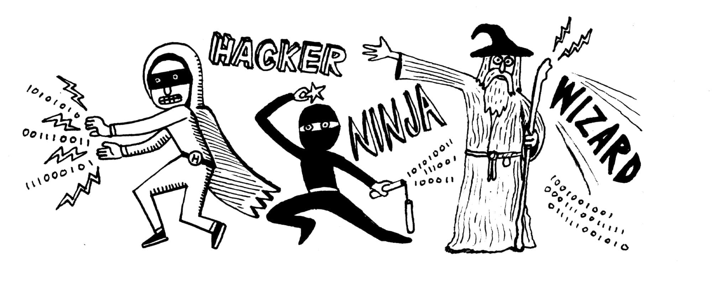
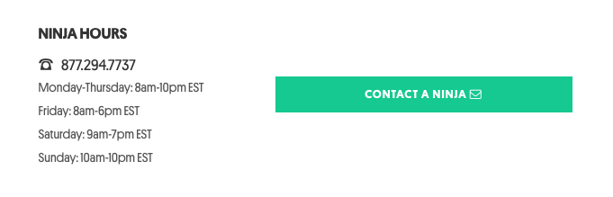
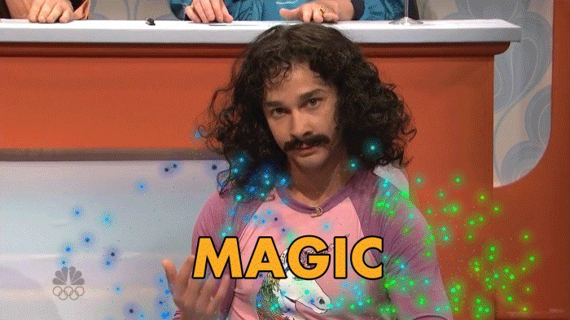

> Título original: I’m a boring programmer (and proud of it)
>
> url original: https://m.signalvnoise.com/i-m-a-boring-programmer-and-proud-of-it-d4ac3dd2defe

Estereotipos de programadores (si crees en esas búsquedas laborales tontas) Ilustración por [Nate Otto](https://twitter.com/nongallery).

Tengo que hacer una confesión - No soy una estrella de Rock. Tampoco soy un Hacker, no sé ninjutsu, y nunca nadie se refirió a mí como un mago.

Aún así, me enorgullezco en ser un programador bueno y sólido. Un programador que trabaja duro en sus cosas y realmente lo disfruta, incluso sin recibir esos calificativos tan lujosos.

Casi todas las semana veo un pedido laboral buscando programadores ninja, que asumo que cortan lineas de código con una precisión increíble. A veces leo acerca de estrellas de rock de la tecnología, que me imagino que escriben funciones tan bonitas como el solo de "Stairway to Heaven". Y escucho a las personas lanzar la palabra "hacker" (y sus derivados como hack, hackfest y hackathon)  como si picar al azar sobre algo o hacer palanca para pasar sobre un sistema no autorizado fuera una cosa buena.

Y no nos olvidemos de esos magos increíbles, que pueden convertir la nada en algo con su ...

No hay hechizos mágicos que solucionen los males de tu código.

Con nombres y habilidades místicas tan geniales dando vueltas, parece que estos estereotipos deberían modelar la actividad de todos los programadores.

Pero que sucede si, al igual que a mí, no te gustan en absoluto esas etiquetas y calificativos. Si no te sientes identificado de alguna forma con una estrella de rock-ninja-hacker-mago, ¿tal vez estás haciendo algo mal?. **No**.

## Los modelos de roles reales (los modelos aburridos)

Lo admito, en lugar tener etiquetas para genios con el ego al máximo, que buscan riesgos emocionantes y que pueden conjurar soluciones mágicas, tengo modelos de roles mucho más modestos. Me siento más identificado con un bibliotecario, un científico, un artista y un carpintero. 

Comparado con una estrella de rock-ninja-hacker-mago, estas etiquetas suenan un poco aburridas, ¿pero sabes qué?, no hay absolutamente nada malo con eso.

> Porque cuando se trata de programar y construir grandes productos, no quiero tener un estilo de vida de una estrella de rock-ninja-hacker-mago. No necesito destacarme o tener fama. No quiero quedarme despierto hasta las 4 a.m. cada noche y quemarme. No hay conjuro mágico que pueda curar mis males de código.

En lugar de eso, como un *bibliotecario* disfruto el silencio y el orden. Cuando el código está bien organizado, las cosas son más fáciles de encontrar y es menos probable que se rompan, se evita un montón de ruido y frustración.

Al igual que un *científico* disfruto analizar problemas, intentar diferentes enfoques para resolverlos, y compartir mis descubrimientos. Busco entender cómo funcionan las cosas, y quiero que otros se beneficien de ese entendimiento.

Como un *artista* ocasionalmente necesito pensar de manera independiente, aprovechar mi creatividad y se capaz de ver lo abstracto. Quiero aceptar la imperfección.

Y como un *carpintero*, realmente disfruto construir cosas. A veces eso significa seguir un plan específico, y otras veces significa seguir trabajando con eso en que estabas.

Apuesto que existen muchos de ustedes que han pensado lo mismo. Ves esos términos tan tontos tan frecuentemente... no tiene sentido, y generalmente se usan para describir puestos de trabajo que parecen atractivos. Parte de vos se ríe, deseando saber cómo se inició esta jerga. Pero otra parte de vos se pregunta por qué no puedes relacionarte con ser una estrella de rock-ninja-hacker-mago.

Para aquellos que se sientan así, les digo esto: No los escuchen, ignórenlos. Si ves una solicitud de trabajo con esas palabras, corre tan lejos como puedas. Disfruta el hecho de que no eres una estrella de rock-ninja-hacker-mago. Probablemente ya seas un gran programador haciendo un buen trabajo, solo que sin todo ese brillo y glamour innecesario.

Y ya sea que lo sepas o no, todas las personas que te rodean aprecian lo bueno que eres realmente.

