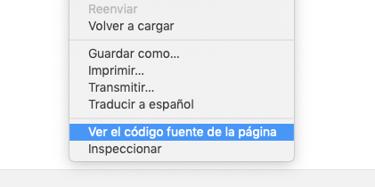
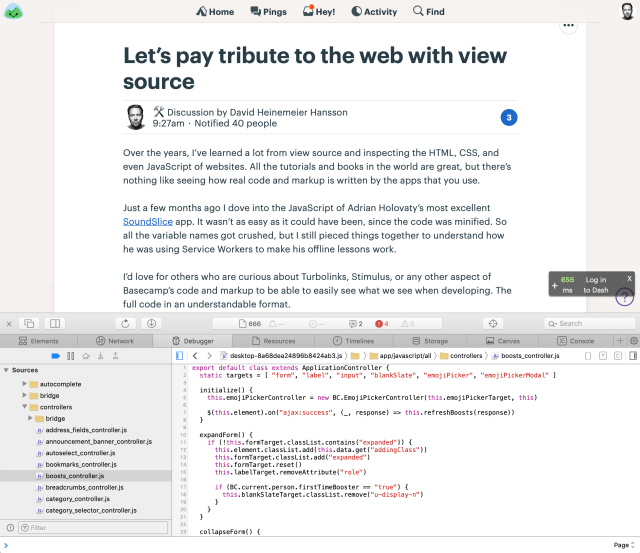

> Traducción del artículo: https://m.signalvnoise.com/paying-tribute-to-the-web-with-view-source

La web no es solo otra plataforma de software. Es la plataforma de software más grande que existe. Incluso en su plena majestuosidad, seguimos aprendiendo a valorar cada una de las partes que la conforman. Tomemos como ejemplo la funcionalidad "Ver código fuente".

{:class="margin-auto"}

Debo gran parte de mi carrera a esta funcionalidad. Es lo que me llevó a empezar con el desarrollo web al principio. Visitando los sitios que me gustaban, aprendiendo cómo hicieron lo que hicieron viendo el código.

Sí, también compré un montón de libros de O'Reilly, con dibujos de animales en las tapas, leí la sección webmonkeys de WIRED, y la web estaba llena de tutoriales incluso en aquella época. Pero no era lo mismo. Ver cómo se construye algo real viendo el código pone las piezas del rompecabezas de una forma que los códigos de ejemplos o lecciones abstractas no pueden hacer.

Por supuesto no soy la única persona que vivió esta historia. [Jason aprendió HTML de la misma forma](https://twitter.com/jasonfried/status/1089945973483278337). De hecho, [un](https://twitter.com/adambader/status/1089983309843640320) [montón](https://twitter.com/obezuk/status/1089978781182226432) [de](https://twitter.com/kennethpbowen/status/1089991690688122883) personas dieron sus primeros pasos usando las maravillosa funcionalidad de ver el código de fuente de la web.

Lamentablemente, esta funcionalidad de "Ver el código fuente de la página" ha retrocedido en estos últimos años. Construir cosas para la web [nunca había sido tan complicado como ahora](https://css-tricks.com/the-great-divide/). Y muy pocas de las herramientas, técnicas o frameworks nuevos parecen priorizar hacer el código accesible. Es una verdadera lástima, el progreso no tiene que ser enemigo del aprendizaje.

Tomemos como ejemplo los archivos "source maps". JavaScript floreció en el mismo periodo de tiempo en que la funcionalidad de "ver el código fuente de la página" comenzó a retroceder. En parte porque Babel, al igual que Webpack y otros, hacen mucho mas sencillo construir cosas grandes usando funcionalidades planificadas en el futuro de JavaScript, e incluso con dialectos completos como TypeScript o CoffeeScript. Pero estos compiladores, para hacer todo eso, producen archivos que son muy difíciles de leer para las personas, especialmente cuando incluso se minifican. Ahí es donde estos archivos "source maps" entran en escena.

Un archivo "source map" permite ver el código tal y cómo lo escribió el programador en primer lugar, con nombres de variables entendibles, completo de comentarios y toda la ayuda necesaria que le permite a los programadores entender el código. Y como bonus, solo se envía por la red cuando el usuario tiene las herramientas de desarrollo abiertas en su navegador.

Pero estos archivos se ven generalmente como una herramienta de desarrollo local, no algo que se envía a un entorno de producción, incluso aunque algunas personas lo hacen, por ejemplo para depurar errores en vivo de manera mucho mas fácil. Esto último, en sí, es una excelente razón para incluir los archivos "source map" en producción.

Entonces, buscamos rendir homenaje a la web, a la herencia de la funcionalidad "ver código fuente de la página", para facilitarle a la personas jugar, aprender o auditar el código que se ejecuta en nuestros navegadores. Las herramientas de desarrollo interactivo que están disponibles en los navegadores modernos permiten una experiencia maravillosa, siempre y cuando se pueda leer el código.

Esto es similar al principio de [Tener derecho a poder reparar](https://repair.org/stand-up/). No agrupes o empaquetes todas las piezas de tu aplicación juntas de tal manera que aleje a las personas que quieren inspeccionar lo que hay debajo de la superficie.

Proveer los archivos "source map" por sí solos no es suficiente. Enviar a los usuarios HTML y CSS legible también es muy importante. Las aplicaciones web modernas tienen una armonía entre HTML, CSS y JavaScript. Para entender una aplicación, se necesita poder entender cada una de sus partes.

En [Basecamp](https://basecamp.com/), llevamos mucho tiempo recorrido por este camino con nuestro HTML y CSS. Seguimos la convención de nombrado de CSS llamada BEM, y si inspeccionas alguno de elementos del HTML o del estilo, realmente [vas a entener qué está pasando](https://xotv.me/channels/22-important/vod_videos/781-important-slash-slash-basecamp-dot-com).

Pero como señaló [Tom Dale](https://twitter.com/dhh/status/1089284763230195717) cuando me [quejé acerca de la porquería que generan los compiladores en HTML](https://twitter.com/dhh/status/1089179428788133888), nosotros en basecamp no habíamos hecho nuestra parte para lograr que nuestro JavaScript sea posible de inspeccionar. Eso fue un error. ¡Y hoy nos estamos rectificando!

¡Ahora todo el JavaScript que corre en Basecamp 3 bajo Webpack tiene los archivos "source maps" disponibles!. Todavía estamos investigando qué se necesita para exponer los "source maps" de las partes que se escribieron pensando en el procesador anterior (Sprorockets), pero todos nuestros controladores hechos en Stimulus, que se compilan y empaquetan usando Webpack, ahora son más fáciles de leer y se puede aprender de ellos.

Adicionalmente, [Rails 6 está comprometido a incluir los source maps por omisión en producción](https://github.com/rails/webpacker/issues/769#issuecomment-458216151) gracias a Webpack. De todas formas, tenes la posibilidad de desactivar esta configuración, ¡pero esperamos que no!.

La web se convierte en un lugar mejor cuando permitimos que otras personas puedan aprender de nuestro trabajo.

Esta es una misión que es cercana y querida en mi corazón en Basecamp. Y es el motivo por el que liberamos como open source tanto código que escribimos. Diría que cerca del 90% de todo el código que corre Basecamp es open source en la forma de [Ruby on Rails](https://rubyonrails.org/),  [Turbolink](https://github.com/turbolinks/turbolinks), [Stimulus](https://stimulusjs.org/) y la tonelada de otros paquetes que lanzamos durante décadas.

Me gusta pensar en Basecamp como un hospital universitario. El cuidado de nuestros usuarios es nuestra prioridad, pero no es la única. También cuidamos al personal que lleva adelante el lugar, y tratamos de enseñar y difundir todo lo que aprendemos. La promesa de proteger la funcionalidad de "ver el código fuente" encaja a la perfección con eso.

La web es una plataforma maravillosa. Única. Qué brinda tanto empoderamiento. Es fácil caer en la trampa de preguntarse "¿Qué puede hacer la web por mí, por mi negocio, por mis clientes". A veces, vale la pela dar unos pasos hacia atrás y preguntarse: "¿Qué puedo hacer por la web?". Una respuesta: Proteger y promover la funcionalidad "Ver el código fuente".