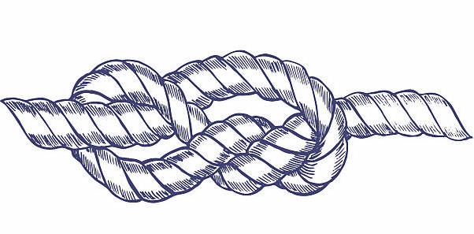

- Traducción del artículo: [This Page is Designed to Last](https://jeffhuang.com/designed_to_last/)
- Autor Original: [Jeff Huang](https://jeffhuang.com/)

<!-- A Manifesto for Preserving Content on the Web -->

<!-- This Page is Designed to Last -->

<!-- By Jeff Huang on 2019-12-19  -->

<!-- For a professor, the end of the year is an opportunity to clean up and
reset for the upcoming new semester. I found myself clearing out old
bookmarks—yes, bookmarks: that formerly beloved browser feature that seems to
have lost the battle to 'address bar autocomplete'. But this nostalgic act of
tidying led me to despair. -->

Para un profesor, el fin de año es una oportunidad para limpiar y reiniciar
las cosas para el nuevo semestre. Me encontré limpiando mi lista de sitios
favoritos - sí, la lista de sitios favoritos, esa querida característica
de los navegadores que perdió la batalla frente a la barra de direcciones
que ahora tiene autocompletado.

Aunque este acto nostálico de ordenar me llevó a la desesperación.

<!-- Bookmark after bookmark led to dead link after dead link. Vanished are
amazing pieces of writing on kuro5hin about tech culture, and a collection of
mathematical puzzles and their associated discussion by academics that my
father introduced me to; gone are Woodman's Reverse Engineering tutorials from
my high school years, where I first tasted the feeling of dominance over
software; even my most recent bookmark, a series of posts on Google+ exposing
usb-c chargers' non-compliance with the specification, disappeared. -->

Cada uno de los sitios marcados como favoritos me llevó a links rotos, uno
tras otro. Desaparecidas quedaron las piezas maravillosas de escritos en [kuro5hin](https://en.wikipedia.org/wiki/Kuro5hin)
sobre cultura tecnológica, y una colección de puzzles matemáticos con sus
discusiones asociadas de matemáticos que me presentó mi papá; se fueron los
tutoriales de ingeniería inversa de Woodman que leía en mis años de escuela
secundaria, donde conocí el sentimiento de dominación del software gracias
a esos textos; incluso mis sitios marcados como favoritos más recientes, una
serie de post en Google+ exponiendo los cargadores usb-c no compatibles
con la especificación. Todo desapareció.

<!-- This is more than just link rot, it's the increasing complexity of keeping
alive indie content on the web, leading to a reliance on platforms and
time-sorted publication formats (blogs, feeds, tweets). -->

Esto es mucho más que links que dejan de funcionar, es sobre la creciente
complejidad de mantener vivo el contenido independiente en la web, conduciendo
todo hacia plataformas y formatos de publicación ordenadas cronológicamente
(blogs, feeds, tweets).

<!-- Of course, I have also contributed to the problem. A paper I published 7
years ago has an abstract that includes a demo link, which has been taken over
by a spammy page with a pumpkin picture on it. Part of that lapse was laziness
to avoid having to renew and keep a functioning web application up year after
year. -->

Por supuesto, yo también contribuí al problema. Un paper que publiqué hace
7 años tenía una nota donde se incluía un link a una demo, que luego fue tomada 
como una pagina de spam por un servicio. Parte de ese lapso reconozco que tuve pereza
de renovar y mantener funcionando la demo web año tras año.

<!-- I've recommended my students to push websites to Heroku, and publish
portfolios on Wix. Yet every platform with irreplaceable content dies off some
day. Geocities, LiveJournal, what.cd, now Yahoo Groups. One day, Medium,
Twitter, and even hosting services like GitHub Pages will be plundered then
discarded when they can no longer grow or cannot find a working business model.
-->

He recomendado a mis alumnos poner sitios web en Heroku, y publicar sus
portfolios en Wix. Aunque todas las plataformas con contenido irreemplazable
mueren algún día. Geocities, LiveJournal, what.cd, y recientemente Yahoo Groups. Un
día, Medium, Twitter, e incluso sitios de alojamiento como GitHub Pages van
a ser saqueados y luego descartados cuando ya no puedan crecer o no encuentren
un modelo de negocios que les funcione.

<!-- The problem is multi-faceted. First, content takes effort to maintain. The
content may need updating to remain relevant, and will eventually have to be
rehosted. A lot of content, what used to be the vast majority of content, was
put up by individuals. But individuals (maybe you?) lose interest, so one day
maybe you just don't want to deal with migrating a website to a new hosting
provider. -->

El problema tiene muchas facetas. Primero, lleva esfuerzo mantener el contenido. El
contenido puede necesitar actualizaciones para mantenerse relevante, y eventualmente
va a tener que mudarse a otro sitio. Un montón de contenido, que solía ser la gran
mayoría del contenido, fue generado por personas individuales. Pero las personas (¿tal
vez vos?) pierden el interés, así que tal vez un día simplemente no quieren lidiar
con la migración de un sitio web a otro proveedor de alojamiento web.

<!-- Second, a growing set of libraries and frameworks are making the web more
sophisticated but also more complex. First came jquery, then bootstrap, npm,
angular, grunt, webpack, and more. If you are a web developer who is keeping up
with the latest, then that's not a problem. -->

Segundo, la creciente cantidad de bibliotecas y frameworks están haciendo la web
mucho más sofisticada pero al mismo tiempo más compleja. Primero jquery, luego
boostrap, npm, angular, grunt, webpack y más. Si sos un desarrollador web que
se mantiene actualizado con lo último, esto último no te va a parecer un problema.

<!-- But if not, maybe you are an embedded systems programmer or startup CTO or
enterprise Java developer or chemistry PhD student, sure you could probably
figure out how to set up some web server and toolchain, but will you keep this
up year after year, decade after decade? Probably not, and when the next year
when you encounter a package dependency problem or figure out how to regenerate
your html files, you might just throw your hands up and zip up the files to
deal with "later". Even simple technology stacks like static site generators
(e.g., Jekyll) require a workflow and will stop working at some point. You fall
into npm dependency hell, and forget the command to package a release. And
having a website with multiple html pages is complex; how would you know how
each page links to each other? index.html.old, Copy of about.html, index.html
(1), nav.html? -->

Pero si no es así, tal vez seas un programador de sistemas embebidos o un
director de tecnología en una startup o un desarrollador de Java para empresas
o un estudiante de doctorado en química. Por supuesto podrías encontrar la
forma de poner en funcionamiento un servidor web y corregir problemas de actualización
con las herramientas, ¿pero podrías mantener esa consistencia año tras año, década
tras década?, Probablemente no. Y cuando el siguiente año te encuentras con
un problema de dependencia en los paquetes o te encuentres con problemas para
generar los archivos .html de tu sitio, tal vez te rindas y hagas un .zip con
los archivos para verlo "después". Incluso los conjuntos de tecnologías más simples
como los generadores de sitios estáticos (como Jekyll) requieren un conjunto de
herramientas que dejarán de funcionar en cierto punto. Vas a caer en el
infierno de las dependencias de npm, y olvidar el comando para empaquetarlo todo y
hacer un lanzamiento. Y tener sitios con múltiples páginas es complejo; ¿cómo vas a
saber a qué páginas hace referencia cada uno de los links?. ¿"index.html.old", "Copia de about.html",
"index.html (1)", "nav.html"?

<!-- Third, and this has been touted by others already (and even rebutted), the
disappearance of the public web in favor of mobile and web apps, walled gardens
(Facebook pages), just-in-time WebSockets loading, and AMP decreases the
proportion of the web on the world wide web, which now seems more like a
continental web than a "world wide web". -->

Y tercero, y esto ha sido ha sido mencionado por otros (e incluso [refutado](https://gomakethings.com/the-web-is-not-dying/)), la
desaparición de la web pública en favor de la web mobile o aplicaciones web, Walled
Gardens (Facebook pages), carga a través de websockets y AMP reducen la proporción
de la red a nivel global, que ahora se parece más a una red continental en
lugar de una red "verdaderamente global".

<!-- So for these problems, what can we do about it? It's not such a simple
problem that can be solved in this one article. The Wayback Machine and
archive.org helps keep some content around for longer. And sometimes an
altruistic individual rehosts the content elsewhere. -->

Así que en base a estos problemas, ¿qué podemos hacer al respecto?. Este no
es un problema simple que se puede resolver en este artículo. El proyecto
The Wayback Machine y [archive.org](https://archive.org/) ayuda a mantener
cierto contenido por más tiempo. Y a veces alguna personas reubican
el contenido en otros lugares.

<!-- But the solution needs to be multi-faceted. How do we make web content
that can last and be maintained for at least 10 years? As someone studying
human-computer interaction, I naturally think of the stakeholders we aren't
supporting. Right now putting up web content is optimized for either the
professional web developer (who use the latest frameworks and workflows) or the
non-tech savvy user (who use a platform). -->

Pero la solución necesita tener muchas facetas también. ¿Cómo hacemos contenido
para que pueda durar y ser mantenido por al menos 10 años?. Como alguien
que estudia la interacción entre humanos y máquinas, naturalmente creo que las
partes interesadas no somos secundarias. Actualmente, poner contenido en la
web está optimizada tanto para los desarrolladores profesionales (que usan los
últimos frameworks y herramientas) como para los usuarios no expertos en tecnología
(que usan una plataforma).

<!-- But I think we should consider both 1) the casual web content
"maintainer", someone who doesn't constantly stay up to date with the latest
web technologies, which means the website needs to have low maintenance needs;
2) and the crawlers who preserve the content and personal archivers, the
"archiver", which means the website should be easy to save and interpret. -->

Pero creo que tenemos que también considerar 1) a los mantenedores
de contenido web de forma casual, aquellos que no están constantemente
manteniéndose actualizados con las tecnologías web más recientes, lo que significa
que los sitios web tienen que tener pocas necesitas de mantenimiento; 2) los
rastreadores que preservan el contenido, lo que significa que el sitio
debería ser simple de guardar e interpretar.

<!-- So my proposal is seven unconventional guidelines in how we handle
websites designed to be informative, to make them easy to maintain and
preserve. The guiding intention is that the maintainer will try to keep the
website up for at least 10 years, maybe even 20 or 30 years. These are not
controversial views necessarily, but are aspirations that are not mainstream—a
manifesto for a long-lasting website. -->

Así que mi propuesta es una serie de siete sugerencias poco convencionales
sobre cómo gestionar sitios web diseñados para ser informáticos, fáciles
de mantener y preservar. La intención principal es que el mantenedor intente
mantener el sitio web por la menos 10 años, tal vez incluso 20 o 30 años.
Estas no son observaciones necesariamente controversiales, pero sí son
algo no convencionales a modo de manifiesto para sitios web que duren
más tiempo.

<!-- Return to vanilla HTML/CSS – I think we've reached the point where
html/css is more powerful, and nicer to use than ever before. Instead of
starting with a giant template filled with .js includes, it's now okay to just
write plain HTML from scratch again. CSS Flexbox and Grid, canvas, Selectors,
box-shadow, the video element, filter, etc. eliminate a lot of the need for
JavaScript libraries. We can avoid jquery and bootstrap, as they are becoming
less relevant anyways. The more libraries incorporated into the website, the
more fragile it becomes. Skip the polyfills and CSS prefixes, and stick with
the CSS attributes that work across all browsers. And frequently validate your
HTML; it could save you a headache in the future when you encounter a bug. -->

1 - Volver a HTML y CSS tradicional. Creo que alcanzamos un punto en donde
html y css es mas poderoso y agradable de utilizar que nunca. En lugar
de empezar con una plantilla gigante inyectada con varios archivos .js, está
bien solo escribir HTML plano y desde cero otra vez. Características de CSS
como Flexbox y Grid, canvas, selectores, box-shadow, el tag Video, filter etc.
elimina un montón de necesidad de bibliotecas javascript. Podemos evitar
jquery y bootstrap, que de todas maneras se están volviendo menos relevantes.
Podemos omitir los polyfills y prefijos de CSS, y quedarnos con atributos
CSS que funcionan en todos los navegadores. Y validar con frecuencia nuestro
HTML; ya que puede ahorrarnos varios dolores de cabeza en el futuro cuando
encontremos un bug.

<!-- Don't minimize that HTML – minimizing (compressing) your HTML and
associated CSS/JS seems like it saves precious bandwidth and all the big
companies are doing it. But why not? Well, you don't save much because your web
pages should be gzipped before being sent over the network, so preemptively
shrinking your content probably doesn't do much to save bandwidth if anything
at all. But even if it did save a few bytes (it's just text in the end), you
now need to have a build process and to add this to your workflow, so updating
a website just became more complex. And it's unfriendly to your users; so many
people got their start with HTML by smashing that View Source button, and
minimizing your HTML completely prevents this amazing ideal of seeing something
cool and learning by seeing what they did. Minimizing HTML does not preserve
its educational quality, and what gets archived is only the resulting codejunk.
-->

2 - No minimizar ese HTML - Minimizar o comprimir tu HTML y todos los archivos
CSS y Javascript asociados parece que ahorra mucho ancho de banda preciado
por todas las grandes compañías que lo hacen. ¿Por qué no?, Bueno, no vas a
ganar mucho porque tus páginas web deben estar siendo 'gzippeadas' por el
webserver antes de ser enviadas por la red, así que achicar tu contenido
preventivamente probablemente no contribuya a reducir el ancho de banda
en absoluto. Pero incluso si eso ahorra unos pocos bytes (que es texto después
de todo), vas a necesitar tener un proceso de compilación y agregarlo a tus
herramientas, así que actualizar el sitio web se vuelve más complejo. Y es
poco amistoso con tus usuarios también, muchas personas dieron sus primeros
pasos con HTML pulsando la opción "Ver código fuente", y minimizar tu
HTML prohibe completamente esta idea apasionante de ver algo cool y aprenderlo
mirando cómo se hizo. Minimizar HTML no preserva su calidad educacional, y lo
que se archiva es solo el resultado de código basura.

<!-- Prefer one page over several – several pages are hard to maintain. You can
lose track of which pages link to what, and it also leads to some system of
page templates to reduce redundancy. How many pages can one person really
maintain? Having one file, probably just an index.html, is simple and
unforgettable. Make use of that infinite vertical scroll. You never have to dig
around your files or grep to see where some content lies. And how should your
version control that file? Should you use git? Shove them in an 'old/' folder?
Well I like the simple approach of naming old files with the date they are
retired, like index.20191213.html. Using the ISO format of the date makes it so
that it sorts easily, and there's no confusion between American and European
date formats. If I have multiple versions in one day, I would use a style
similar to that which is customary in log files, of index.20191213.1.html. A
nice side effect is then you can access an older version of the file if you
remember the date, without logging into the web host. -->

3 - Preferir una página en lugar de muchas - Muchas páginas es más difícil
de mantener. Podes perder el control de qué página apunta a cual, y también
conduce a algún sistema de plantillas para reducir la repetición.  ¿Cuantas
páginas realmente puede mantener una sola persona? Teniendo un solo archivo,
probablemente "index.html", es más simple e imposible de olvidar. Has uso
de ese scroll que no se termina. No vas a tener que escarbar entre los
archivos para ver dónde está el contenido. ¿Y cómo debería
poner en un control de versiones ese archivo?, ¿debería usar git?, ¿Meterlo
en una carpeta "old/"?. A mí me gusta un enfoque simple que consiste en nombrar
a los archivos con la fecha en la que fueron retirados, como index.20191213.html.
Usando el formato de fechas ISO los archivos se pueden ordenar fácilmente de forma
cronológica, y no hay confusión entre sistemas de formatos de datos Americanos
o Europeos. Si tienes múltiples versiones de un archivo en un día, podrías 
usar un estilo similar al que se utiliza frecuentemente en los archivos de log, como
index.20191212.1.html. Un lindo efecto colateral es que vas a poder acceder las
versiones anteriores de un archivo si recuedas la fecha, sin siquiera ingresar
en el host a ver el listado de archivos.

<!-- End all forms of hotlinking – this cautionary word seems to have
disappeared from internet vocabulary, but it's one of the reasons I've seen a
perfectly good website fall apart for no reason. Stop directly including images
from other websites, stop "borrowing" stylesheets by just linking to them, and
especially stop linking to JavaScript files, even the ones hosted by the
original developers. Hotlinking is usually considered rude since your visitors
use someone else's bandwidth, it makes the user experience slower, you let
another website track your users, and worse of all if the location you're
linking to changes their folder structure or just goes offline, then the
failure cascades to your website as well. Google Analytics is unnecessary;
store your own server logs and set up GoAccess or cut them up however you like,
giving you more detailed statistics. Don't give away your logs to Google for
free. -->

4 - Elimina todas las formas de hotlinking - esta palabra parece haber desaparecido
del vocabulario de Internet, pero es una de las razones por las que he visto
sitios perfectamente buenos desmoronarse sin ninguna razón aparente. Deja de incluir
imágenes desde otros sitios web, deja de "tomar prestadas" las hojas de estilo
solamente poniendo un link a ellas, y especialmente deja de poner links a archivos
JavaScript externos, incluso aquellos que son alojados por los mismos desarrolladores
originales. Hotlinking [generalmente se considera algo rudo](https://webmasters.stackexchange.com/questions/25315/hotlinking-what-is-it-and-why-shouldnt-people-do-it) ya que tus visitantes
usarán el ancho de banda de alguien más, hace la experiencia del usuario más lenta,
estarás dejando que el otro sitio web rastree a tus visitantes, y lo peor de todo:
si la locación del archivo que estás solicitado cambia de ubicación o simplemente
pasa a estar offline, entonces la cascada de errores llegará a tu sitio web también.
Google Analitics es innecesario; almacena tus propios logs y configura GoAccess o
léelos como quieras. No les regales tus registros de logs a Google.

<!-- Stick with the 13 web safe fonts +2 – we're focusing on content first, so
decorative and unusual typefaces are completely unnecessary. Stick with a small
palette and the 13 web-safe fonts. Okay, so maybe you really need a
neo-grotesque typeface that's not Arial/Helvetica, or you need a geometric
typeface. Then go with what's minimally necessary, like Roboto (for
neo-grotesque) and Open Sans (for geometric); they're the two most popular
typefaces on Google Fonts so most likely to already be cached on your users'
computer. Besides those +2 fonts, your focus should be about delivering the
content to the user effectively and making the choice of font to be invisible,
rather than stroking your design ego. Even if you use Google Fonts, they don't
need to be hotlinked. Download the subset you need and locally serve them from
your own folders. -->

5 - Quédate con las 13 fuentes seguras +2 - Ponemos el foco en el contenido
primero, así que tipografías inusuales o decorativas son completamente innecesarias.
Quédate con una paleta pequeña y las 13 fuentes estándar de los navegadores. Ok, tal
vez realmente necesites una tipografía neo-grotesque que no es Arial ni Helvetica,
o necesitas una tipografía geométrica. En ese caso, ve por las mínimamente necesarias,
como Roboto y Open Sans; estas son las dos tipografías más populares en Google Fonts
así que lo más problable es que estén almacenadas en el cache de la computadora
de tus usuarios. Además de esas dos fuentes extra, tu foco debería estar
en entregar el contenido al usuario de manera efectiva y hacer que la decisión
de la fuente sea invisible en lugar de acariciar tu ego de diseño. Incluso si
usas Google Fonts, no necesitas que estén vinculadas mediante hotlinking. Descargá
el conjunto de fuentes que necesitas y utilízalas localmente desde tus propios
directorios.

<!-- Obsessively compress your images – faster for your users, less space to
archive, and easier to maintain when you don't have to back up a humongous
folder. Your images can have the same high quality, but be smaller. Minify your
SVGs, losslessly compress your PNGs, generate JPEGs to exactly fit the width of
the image. It's worth spending some time figuring out the most optimal way to
compress and reduce the size of your images without losing quality. And once
WebP gains support on Safari, switch over to that format. Ruthlessly minimize
the total size of your website and keep it as small as possible. Every MB can
cost someone real money, and in fact, my mobile carrier (Google Fi) charges a
cent per MB, so a 25 MB website which is fairly common nowadays, costs a
quarter itself, about as much as a newspaper when I was a child. -->

6 - Comprimí tus imágenes agresivamente - es más rápido para tus usuarios, ocupará
menos espacio a la hora de archivar y más fácil de mantener cuando no tengas que
hacer una copia de seguridad de una carpeta enorme. Tus imágenes pueden tener
la misma calidad, pero ser más pequeñas. Minificar tus archivos SVG, comprimir tus
archivos PNGs sin pérdida de calidad, y generar archivos .JPG que coincidan exactamente
con el tamaño en que se muestran en el html. Vale la pena pasar tiempo buscando
la manera óptima de comprimir y reducir el tamaño de tus imágenes sin perder calidad. Y
una vez que WebP gane soporte en Safari, cambia a ese formato. Reduce despiadadamente
el tamaño total de tu sitio web y mantenlo lo más pequeño posible. Cada MB puede
costar algo de dinero real, y de hecho, mi operador de telefonía móvil cobra
centavos por cada MB, así que un sitio web de 25MB que es bastante común hoy
en día cuesta casi como un periódico cuando era niño.

<!-- Eliminate the broken URL risk – there are monitoring services that will
tell you when your URL is down, preventing you from realizing one day that your
homepage hasn't been loading for a month and the search engines have deindexed
it. Because 10 years is longer than most hard drives or operating systems are
meant to last. But to eliminate the risk of a URL breaking completely, set up a
second monitoring service. Because if the first one stops for any reason (they
move to a pay model, they shut down, you forget to renew something, etc.) you
will still get one notification when your URL is down, then realize the other
monitoring service is down because you didn't get the second notification.
Remember that we're trying to keep something up for over 10 years (ideally way
longer, even 30 years), so a lot of services will shut down during this period,
so two monitoring services is the safer way. -->

7 - Elimina el riesgo de una URL caída - Hay servicios de monitoreo que te avisarán
cuando tu URL se caiga, evitando que te des cuenta un día que tu sitio web
estuvo caído un mes y los buscadores te han quitado de sus resultados de búsqueda
a causa de esa caída. Porque 10 años es mucho más tiempo del que los discos duros
y sistemas operativos están diseñados para durar. Pero para eliminar por completo
el riesgo de una URL rota, configura un segundo servicio de monitoreo. Ya que si
el primero deja de funcionar por alguna razón (si se mueven a un modelo de
pago, se apagan u olvidaste renovar algo, etc) aún recibirás una notificación
cuando tu URL se caiga, y así te darás cuenta que el segundo servicio de monitoreo
se cayó porque no recibiste la segunda notificación. Recuerda: estamos intentando
mantener algo por más de 10 años (idealmente mucho más, incluso 30 años), así
que un montón de servicios van a darse de baja durante ese periodo; entonces, dos
servicios de monitorización es la forma más segura.

<!-- After doing these things, go ahead and place a bit of text in the footer,
"The page was designed to last", linking to this page explaining what that
means. The words promise that the maintainer will do their best to follow the
ideas in this manifesto. -->

Después de hacer estas cosas, pon un poco de texto en el pie de página: "Esta
página fue diseñada para durar", con un link a esta página explicando qué
significa. Estas palabras prometen que el mantenedor hace su mejor esfuerzo
para seguir las ideas en este manifiesto.

<!-- Before you protest, this is obviously not for web applications. If you are
making an application, then make your web or mobile app with the workflow you
need. I don't even know any web applications that have remained similarly
functioning over 10 years (except Philip Guo's python tutor, due to his
minimalist strategy for maintaining it) so it seems like a lost cause anyway.
It's also not for websites maintained by an organization like Wikipedia or
Twitter. You do your thing, and the salary for an IT team is probably enough to
keep something alive for a while. -->

Y antes de que objetes, esto obviamente no es para aplicaciones web. Si estás
haciendo una aplicación, hace tu web o aplicación mobile siguiendo el flujo
de trabajo que necesites. Ni siquiera conozco alguna aplicación web que se
mantenga funcionando de forma similar por más de 10 años (excepto el tutor
de python de Philip Guo, a través de su
[estratégia minimalista para mantenerla](http://www.pgbovine.net/python-tutor-ten-years.htm)
así que esta guía no intenta abarcar aplicaciones. Tampoco es para sitios web
mantenidos por una organización como Wikipedia o Twitter. Cada uno con sus
cosas, y el salario de un equipo de IT es probablemente suficiente para
mantener algo vivo por un buen tiempo.

<!-- In fact, it's not even that important you strictly follow the 7 "rules",
as they're more of a provocation than strict rules. -->

De hecho, tampoco es tan importante que sigas estrictamente estas 7 "reglas", 
ya que son más una provocación que reglas estrictas.

<!-- But let's say some small part of the web starts designing websites to last
for content that is meant to last. What happens then? Well, people may prefer
to link to them since they have a promise of working in the future. People more
generally may be more mindful of making their pages more permanent. And users
and archivers both save bandwidth when visiting and storing these pages. -->

Pero digamos que alguna pequeña parte de la web comienza a diseñar sitios web
para hacer durar el contenido que se quiere preservar por más tiempo. ¿Qué
pasará entonces?, bueno, las personas puede preferir hacer links a esos
sitios ya que se han comprometido a seguir trabajando en el futuro. Las personas
podrían volverse más conscientes en hacer sus páginas más permanentes. Y tanto
los usuarios como los archivadores salvarán ancho de banda cuando visiten
y almacenen esas páginas.

<!-- The effects are long term, but the achievements are incremental and can be
implemented by website owners without being dependent on anyone else or waiting
for a network effect. You can do this now for your website, and that already
would be a positive outcome. Like using a recycled shopping bag instead of a
taking a plastic one, it's a small individual action. -->

Los efectos son a largo plazo, pero los logros son incrementales y pueden
ser implementados por dueños de sitios webs sin ser dependientes de nadie más
o esperar por un efecto en red. Puedes hacer esto por ahora por tu sitio web, y
eso en sí mismo es un resultado positivo. Como usar una bolsa de compras
reciclada en lugar de tomar una de plástico, es una pequeña acción individual.

<!-- This article is meant to provoke and lead to individual action, not
propose a complete solution to the decaying web. It's a small simple step for a
complex sociotechnical system. So I'd love to see this happen. I intend to keep
this page up for at least 10 years. -->

Este artículo está destinado a provocar y sugerir una acción individual, no propone
una solución completa a la decadencia de la web. Es un paso simple y pequeño para
un sistema socio-tecnológico complejo. Me encantaría que esto sucediera. Tengo
la intención de mantener esta página por al menos 10 años.

<!-- Thanks to my Ph.D. students Shaun Wallace, Nediyana Daskalova, Talie
Massachi, Alexandra Papoutsaki, my colleagues James Tompkin, Stephen Bach, my
teaching assistant Kathleen Chai, and my research assistant Yusuf Karim for
feedback on earlier drafts. -->

Gracias a mis estudiantes de doctorado Shaun Wallace, Nediyana Daskalova, 
Talie Massachi, Alexandra Papoutsaki, a mis colegas James Tompkin, Stephen Bach,
mi asistente de curso Kathleen Chai y mi asistente de investigación Yusuf Karim
por los comentarios sobre los borradores anteriores.

<!-- See discussions on Hacker News and reddit /r/programming -->

Mira los comentarios de este artículo en 
[Hacker News](https://news.ycombinator.com/item?id=21840140) y 
[reddit /r/programming](https://www.reddit.com/r/programming/comments/ed88ra/this_page_is_designed_to_last_a_manifesto_for/)

Esta página está diseñada para durar.

<!-- This page is designed to last. -->
