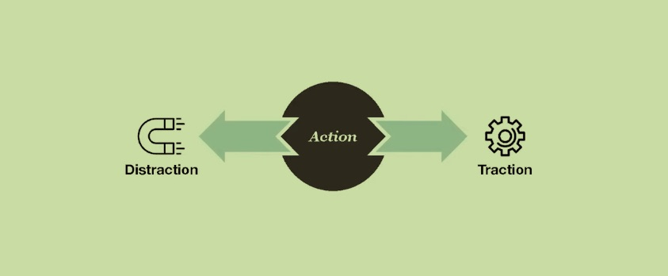
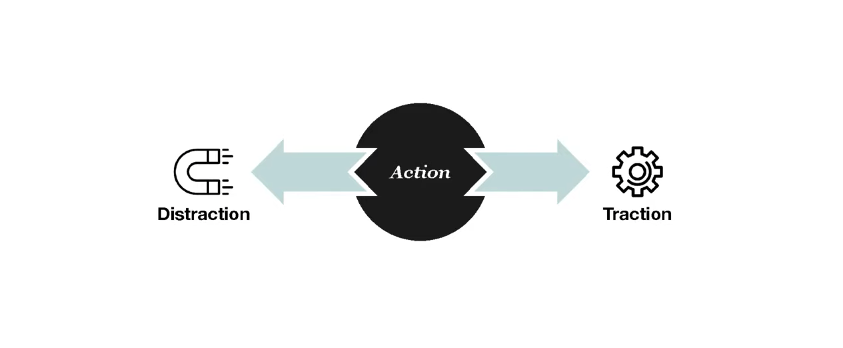
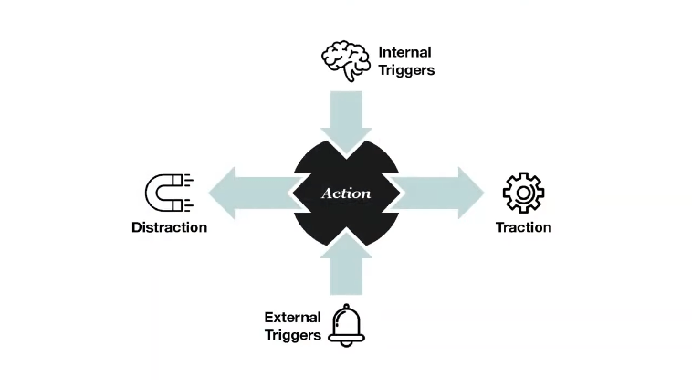
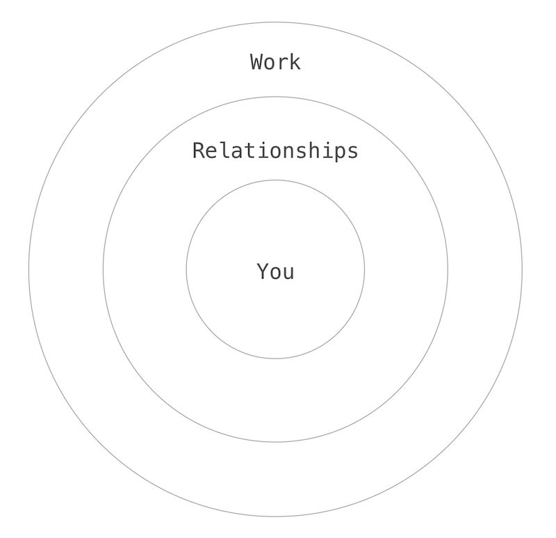
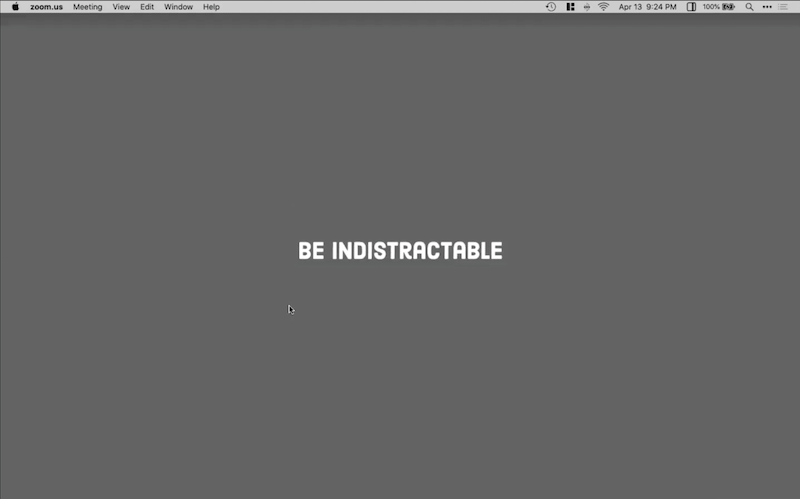

> Traducción de: https://superorganizers.substack.com/p/stop-trying-to-make-hard-work-easy

<!-- Stop Trying to Make Hard Work Easy -->

<!-- Nir Eyal, author of Indistractable, explains how to cope even when work is
hard.  -->

<!--

        Dan Shipper

                                     Stop Trying to Make Hard Work Easy Nir
                                     Eyal, author of Indistractable, explains
                                     how to 11                       cope even
                                     when work is hard.  Dan Shipper Sign up to
                                     like post          11 [https] May
                                     6 5   [                    ]   May  Sign
                                     up to like post Subscribe                5
                                     6 LoginPrivacyTerms             [
                                     ] Subscribe LoginPrivacyTerms

                                     Share

[https] -->

<!-- Nir Eyal thinks we’re spending too much time trying to make work easy.
-->

Nir Eyal piensa que invertimos demasiado tiempo intentando hacer que el trabajo
duro sea fácil.

<!-- He’s a behavioral design expert who taught at Stanford and has written two
best-selling books.  -->

<!-- But he thinks most of the productivity panaceas, like forming habits or
trying to get into flow, that we all turn to in order to get our work done
aren’t always as useful as we might hope: -->

Además piensa que la mayoría de las panaceas de la productividad, como formar
hábitos o intentar entrar en "flow" no son tan útiles como desearíamos.

<!-- “When most people talk about habits, what they’re saying is, ‘I want
something that’s difficult to become effortless. I want the benefits but I
don’t want it to be hard,” Nir said to me in an interview a few weeks ago.
“Well, I have news for you: some things are just hard.  There’s no way of
getting around it.” -->

Nir me dijo en una entrevista hace un par de semanas: "Cuando la mayoría de las
personas habla sobre hábitos, lo que intentan expresar es: 'Quiero que algo que
me resulta difícil se vuelva fácil'. Quiero los beneficios pero no quiero que
sea difícil". Y luego agregó: "Bueno, tengo novedades: algunas cosas son
difíciles, no hay forma de evitar eso."

<!-- The problem is, when we expect work to be effortless and it ends up being
difficult, we often blame ourselves. So the very tools we’re using to make work
easier, can instead make it easier for us to give up. -->

El problema es el siguiente: cuando esperamos que algo sea fácil y resulta que
se vuelve difícil terminamos culpándonos a nosotros mismos. Las herramientas
que estamos usando para hacer el trabajo más fácil en realidad están haciendo
que nos demos por vencidos más rápido.

<!-- Nir recommends a different approach. He thinks the number one barrier to
getting our work done is distraction. It’s all around us: from our social media
feeds, to our app notifications, to pseudo work distractions like our email
inbox or our todo lists. -->

Nir recomienda un enfoque diferente. Piensa que la barrera número 1 que nos
impide realizar el trabajo es la "distracción". Esta distracción está en todos
lados: en las redes sociales, nuestras notificaciones de apps, e incluso en
nuestra bandeja de entrada de email o nuestras listas de tareas.

<!-- Most people think distraction is caused by technology, or that being
distracted means there’s something wrong with them. -->

La mayoría de las personas piensan que la distracción es causada por la
tecnología, o que estar distraído significa que hay algo malo en esa
tecnología.

<!-- But Nir thinks that moments of distraction are actually our own human
reaction to the discomfort we feel when we sit down to do our work.  “They’re
not character flaws, they’re emotional regulation problems,” he says -->

Sin embargo, Nir piensa que esos momentos de distracción en realidad son
originados por nuestra propia reacción humana a la incomodidad que sentimos
cuando nos sentamos a realizar nuestro propio trabajo. "No son falencias de
carácter, son problemas de regulación emocional."

<!-- Nir thinks that we should develop tools to deal with internal discomfort
instead of burying ourselves in distraction. And that once we’re
indistractable, we’ll be ready to do our best work. -->

Nir piensa que deberíamos desarrollar herramientas para superar la
incomodidad interna en lugar de caer en las distracciones. Y en ese momento
seremos capaces de no distraernos.

<!-- In this interview we talk about Nir’s unorthodox definition of
distraction, go through his four-step process to becoming indistractible, and
explore how he uses this process in his own life. -->

En esta entrevista hablamos sobre la definición poco
convencional de Nir sobre la distracción, recorremos el proceso de 4 pasos para
no caer en las distracciones y exploramos como usa este proceso en su vida
personal.

<!-- Let’s dive in! -->

¡Comencemos!

<!-- Nir introduces himself -->

<!-- Hi, I’m Nir Eyal. I'm a behavioral designer which means I use consumer
psychology and behavioral design to help companies build the kind of products
that build good habits in our lives. -->

<!-- I’ve written two books, Hooked and Indistractable. Hooked was about how to
build habit-forming products. Indistractable is about how to break bad habits.
-->

<!-- I taught for many years at Stanford at the Graduate School of Business,
and then later at the Hasso Plattner Institute of Design. And today, I mostly
teach and write about how to build good habits and break bad ones. -->

<!-- Distraction is not what you think it is -->

## La distracción no es lo que pensamos

<!-- Before we can eliminate distraction we have to understand what it is. -->

Antes de que podamos eliminar la distracción necesitamos entender de qué se
trata.

<!-- To define distraction, we’ll define it by what it is not. -->

Para definir distracción, primero vamos a definir aquello que no es
distracción.

<!-- Most people say that the opposite of distraction is focus. But I don’t
think that’s true. I think that the opposite of distraction is not focus, it is
traction. -->

La mayoría de las personas dicen que lo opuesto de la distracción es el "foco".
Pero pero no creo que eso sea así. Pienso que lo opuesto de la distracción es
la "tracción".

<!-- Both “traction” and “distraction” actually come from the same Latin root,
trahere, which means to pull. -->

Tanto "tracción" como "distracción" vienen de la misma raíz del latín,
"trahere", que significa halar (to pull en inglés).

<!-- Traction is any action that pulls you toward what you want to do. By
contrast, distraction is any action that pulls you away from what you planned
to do. -->

Tracción es cualquier acción que te pone en dirección a lo que queres hacer.
Por el contrario, distracción, es cualquier acción que te aleja de lo que
planeabas hacer.

<!-- This is a really, really important point. Because a lot of people in the
productivity space don’t differentiate between traction and distraction. -->

Este es un punto muy importante, porque mucha gente en este espacio de la
productividad no distingue una diferencia entre tracción y distracción.

<!-- You can see this most clearly in people that do a lot of pseudo-work. I
used to do it too: I would sit down at my desk and I would say, “Okay, now I’m
going to get my work done, I’m going to stop procrastinating.  But first let me
just check email real quick. Let me just do that one chore on my todo list.”
-->

Podemos ver esto con mucha más claridad en las personas que hacen un montón de
pseudo-trabajo. A mí también me pasó: Me siendo frente al escritorio y me digo
a mi mismo: "Ok, ahora voy a ponerme a hacer mi trabajo, voy a dejar de
proclastinar. Pero antes voy a revisar rápidamente mi correo, y hacer algunas
de estas tareas de mi lista".

<!-- What people don’t realize is that if you’re buried in your email inbox
instead of doing your most important work, you are just as distracted as if you
went on Facebook or Instagram or whatever. Anything that is not what you
planned to do is by definition a distraction. -->

Lo que las personas no advierten, es que si estás sumergido en tus emails en
lugar de hacer tu trabajo más importante, eso es claramente un estado de
distracción, tal y como si estuvieras en Facebook, Instagram o lo que sea.
Cualquier cosa que no sea lo que tenías planeado hacer es por definición una
"distracción".

<!-- And I think that things like email, or small todo list items are actually
the most pernicious distractions because they feel productive.  If I’m checking
something off of my todo list that feels productive. -->

Pienso que los emails y los items pequeños de las listas de tareas representan
las distracciones más perniciosas porque se sienten como "productivas". Si
estoy marcando como realizada una tarea en mi lista se siente como un progreso.

<!-- What we don’t realize is that in those instances, distraction has tricked
us into prioritizing what feels urgent as opposed to what we really need to be
doing. And that is toxic for your productivity, for your well-being, and for
your happiness. -->

Lo que no nos damos cuenta es que en esas instancias, la distracción se ha
colado aparentando ser urgente en lugar a lo que realmente necesitaríamos estar
haciendo. Y esto es algo tóxico para tu productividad, bienestar y felicidad.

<!-- And by the way, this doesn’t mean that you should never check Twitter or
Facebook. If you want to scroll through Twitter or Facebook, do it!  As long as
you do it with intent, the time you plan to waste is not wasted time. -->

Y por cierto, esto no significa que nunca deberías mirar Twitter o Facebook. Si
queres navegar por Twitter o Facebook, ¡hacelo!. En tanto estés haciendo lo que
intencionalmente decidiste hacer, el tiempo que planeaste gastar no es tiempo
perdido.

<!-- So: anything is a distraction as long as it’s not what you planned to do.
In the same way, anything can be traction, too. -->

Es decir, cualquier cosa puede ser una distracción distracción en la medida de
que sea algo que no planificaste hacer. Y de la misma forma, cualquier cosa
puede ser una "tracción" también.

<!-- The word that differentiates the two is intent. -->

La palabra que produce la diferencia entre estas dos es la "intención".

<!-- Nir has a simple strategy for eliminating distraction -->

Nir tiene una estrategia simple para eliminar la distracción.

<!-- In my book I describe my strategy for eliminating distraction. That word,
strategy, is very important. The strategy is critical, because tactics are a
dime a dozen. -->

En mi libro describo la estrategia que utilizo para eliminar la distracción.
Esta palabra, estrategia, es muy importante. La estrategia es clave, porque las
tácticas no ayudan demasiado.

<!-- There isn’t going to be one tactic that works for everyone. You use the
strategy to try individual tactics until you find the right formula for you.
-->

No existe una táctica que funcione para todos. En todo caso deberías usa una
estrategía que te permita intentar diferentes tácticas individuales hasta que
encuentres la formula correcta para tu caso.

<!-- My strategy for eliminating distraction is as follows: -->

Mi estrategia para eliminar la distracción es la siguiente:

<!-- 1. Master internal triggers

 2. Make time for traction

 3. Hack back external triggers

 4. Prevent distraction with pacts
-->

1. Dominar los disparadores internos de distracción.
2. Reservar tiempo para la "tracción".
3. Bloquear los disparadores externos de distracción.
4. Prevenir las distracciones con pactos.

<!-- That’s it. We’ll go into each of these and talk about what they are. -->

Así es, veamos cada uno de estos puntos y hablemos sobre lo que representa cada
uno de ellos.

<!-- Most moments of distraction are caused by internal triggers -->

La mayoría de las distracciones son causadas por disparadores internos.

<!-- Distraction is caused by two things: internal triggers and external
triggers. -->

La distracción puede ser causada por una de estas dos cosas: disparadores
internos o externos.

<!-- External triggers are all of the things that we already think a lot about.
It’s the pings, and the dings, and all the things in our external environment
that are pulling our attention away from the thing we had planned to spend our
time on. -->

Los disparadores externos son todas esas cosas de las que ya se ha hablado un
montón. Son las alarmas, las interrupciones, y todas aquellas cosas de tu
entorno que te quitan la atención de las cosas que planificaste hacer.

<!-- These are important to pay attention to, but if you actually observe how
people spend their time, the thing that is more likely to steal our attention
is the internal triggers. -->

Es importante prestar atención a estos disparadores, sin embargo cuando
observamos la forma en que las personas gastan su tiempo, las cosas que más
roban la atención de las personas son los disparadores internos.

<!-- Internal triggers are what’s happening inside of us. -->

Los disparadores internos son aquello que sucede dentro nuestro.

<!-- It turns out that distraction and procrastination are actually our default
responses to uncomfortable feelings. They’re not character flaws, they’re
emotional regulation problems. -->

Resulta que la distracción y la procrastinación son nuestra respuesta por
omisión a los sentimientos de incomodidad. No son falencias de carácter, son
problemas de regulación emocional.

<!-- When we procrastinate or distract ourselves it’s because we want to escape
from uncomfortable sensations: boredom, loneliness, fatigue, uncertainty.
Sometimes we escape through news, booze, football, or Facebook. Everyone has
their drug of choice. But we’re all trying to do the same thing with these
distractions: attempting to relieve emotional discomfort. -->

Cuando nos distraemos a nosotros mismos es porque queremos escapar de las
sensaciones incómodas, aburrimiento, soledad, fatiga, incertidumbre. A veces
escapamos a las noticias, el fútbol o Facebook. Cada uno tiene su droga de
preferencia. Pero todos estamos intentando hacer lo mismo con estas
distracciones: intentando escapar de la incomodidad emocional.

<!-- So if you want to deal with distraction the first thing you have to do is
deal with the negative emotional triggers that lead to it. -->

Así que si queremos tratar las distracciones la primer cosa que tenemos que
hacer es tratar con los disparadores emocionales negativos que nos llevan a las
distracciones.

<!-- None of the other shit works, whatever any productivity guru says. You
first and foremost have to start with the internal triggers. -->

Ninguna de las otras cosas funciona, por más que los gurus de la productividad
digan otra cosa. Primero tenemos que empezar con los disparadores internos.

<!-- If you don’t have the tools to deal with emotional discomfort, none of the
life hacks work. -->

Si no tenemos las herramientas para gestionar nuestra incomodidad emocional
ninguno de los "tips" de la vida funcionan.

<!-- How he deals with internal triggers in his writing routine -->

Como Nir trata los disparadores internos en su rutina

<!-- One of the places in my life where I have to deal with a lot of internal
triggers is in my writing routine. -->

Uno de los lugares en mi vida donde tengo que tratar con un montón de mis
disparadores internos es en mi rutina a la hora de escribir.

<!-- I write every day in the morning for 2 hours, 5 days a week. No
exceptions. -->

Escribo cada día en la mañana por dos horas, cinco días a la semana. Sin
excepciones.

<!-- In this system I only have one goal: to work on whatever it is I say I’m
going to work on for as long as I say I’m going to work on it.  That’s it. -->

En este sistema solo tengo una meta: trabajar en cualquier cosa que yo digo que
voy a trabajar, tanto tiempo como me propongo trabajar. Eso es todo.

<!-- What you’ll also notice is that I don’t set a word count. Word counts are
terrible. It’s really hard to use things like word counts because study after
study has shown that people are terrible at predicting how long it will take to
do something. We’re awful at it. -->

Lo que notarás es que no defino una cantidad de palabras como métrica. Contar
palabras es terrible. Es realmente difícil usar cosas como contadores de
palabras porque estudio tras estudio muestra que las personas son terribles
prediciendo cuanto tiempo les tomará hacer algo. Somos malísimos en las
estimaciones.

<!-- So some days I’ll produce 300 words. Sometimes it’s 1,000. Sometimes it’s
3. But it doesn’t matter. I just stay at my desk and try to write for the 2
hours on my schedule. And that’s the most important thing. -->

Así que en un día puedo producir 300 palabras. A veces son 1.000. A veces
solo 3 . No importa, solamente permanezco en mi escritorio e intento escribir las dos
horas que me comprometí a escribir. Y eso es lo más importante.

<!-- Now, people might think that because I write every day that it’s easy. -->

Ahora, las personas piensan que escribir todos los días es fácil.

<!-- That’s just not true. -->

No es cierto.

<!-- When I sit down to write a few things come up regularly. Boredom.
Fatigue. Anxiety. Uncertainty. -->

Cuando me siento a escribir varias cosas vienen a mí de manera regular:
Aburrimiento, fatiga, ansiedad, incertidumbre.

<!-- There’s a lot of uncertainty in writing. I never know if a particular line
of research is going to be a waste of time. Most of the stuff I write about
doesn’t get published. -->

Hay mucha incertidumbre a la hora de escribir. Nunca se si una linea particular
de mi escritura va a ser una pérdida de tiempo. La mayoría de las cosas que
escribo no se publican.

<!-- Most of what I produce isn’t illuminating. It’s not exciting. It gets
trashed. -->

La mayoría de lo que produzco no es revelador, no es interesante, y se tira a
la basura.

<!-- So there’s constantly this uncertainty of, “Is this going to be any good?
Am I right? Are people going to find it useful?” -->

Así que hay una constante incertidumbre en esto: "¿Esto va en buena dirección?,
¿estoy en lo correcto?, ¿las personas van a encontrar mi texto de utilidad?"

<!-- One way to deal with that is to lean into it instead of trying to get away
from it. If you lean into the uncertainty, you can start to find beauty in the
unknown. -->

Una forma de sobrepasar esto es aprender a convivir con ello en lugar de
alejarse. Si aceptas convivir con la incertidumbre vas a poder empezar a
encontrar belleza en lo incierto.

<!-- For example, you can look for the variability in the work — on how the way
you feel about it, that feeling of uncertainty, is changing over time. You can
also focus more intently on the details of the work — the minute details that
make it the way it is. That’s how people learn to love all kinds of things. -->

Por ejemplo, podemos mirar la variabilidad en el trabajo - mirar cómo el
sentimiento de incertidumbre va cambiando con el tiempo. También podemos
observar con más atención los detalles del trabajo, esos detalles minuciosos
que hacer las cosas como son. Así es como las personas aprenden a amar todas
las cosas.

<!-- So a piece of research isn’t this dark scary thing anymore, it starts to
unfold like a flower. You start to see the beauty in the task. For me, that’s
what uncertainty is. It’s actually what drives me back to research now rather
than causing me to be distracted — because I don’t know what’s going to happen.
And that’s exciting. -->

Así que una pieza de investigación deja de ser una cosa aterradora, se empieza
a abrir como una flor. Empezamos a ver la belleza en la tarea. Eso es la
incertidumbre para mí, es lo que me hacer volver a la investigación y hacer
preguntas. No se lo que va a pasar, y eso es emocionante.

<!-- But there are other ways to deal with the triggers that come up too.  For
example, another trigger for me is the desire to look something up.  I’ll be
writing and I’ll get this insane itch to go Google something — which I know
will send me down a rabbit hole of distraction. -->

Pero hay otra forma de gestionar los disparadores internos que aparecen. Por
ejemplo, otro disparador para mí es el deseo de buscar algo en otro lugar: A
veces estoy escribiendo y tengo esta ansiedad por buscar algo en Google, cosa
que me lleva directo a agujero de la distracción.

<!-- l have something I call the 10 minute rule for this. -->

Tengo algo que llamo la regla de los 10 minutos para esto.

<!-- Rather than Google it, what I'll often do is write down on a piece of
paper whatever it is I think I need to look up. And then I'll give myself 10
minutes. And if it's so important after ten minutes then maybe I’ll look it up.
Usually that works, and I can just get back to work. -->

En lugar de buscar en Google inmediatamente, lo que hago es escribir en una
hoja de papel lo que sea que estaba pensando ir a buscar. Y luego, me doy unos
10 minutos. Y si es tan importante después de 10 minutos entonces le daré una
mirada. Y usualmente funciona, puedo volver a trabajar.

<!-- By the time the ten minutes are up what I felt like I needed to Google
doesn’t seem that important anymore. -->

Casi siempre cuando pasan los 10 minutos lo que sentía que necesitaba buscar en
Google ya no me parece importante.

<!-- Sometimes, though, the urge doesn’t go away. It’s the same type of urge
that you might feel when you want to eat a piece of chocolate cake. -->

Sin embargo, a veces, la urgencia no se va. Es el mismo tipo de urgencia que
podrías sentir cuando queres comer una porción de torta de chocolate.

<!-- If that happens, then I do what I call “surfing the urge.” You basically sit
with the sensation, and examine it. You’ll find that if you can do that, it
doesn’t last forever — even though it feels like it will.
-->

Si esto ocurre, entonces hago lo que llamo "surfear la orgencia": que básicamente
consta en detenerse en la sensación y examinarla. Vas a notar que si podes hacer
eso no dudará por siembre, incluso cuando parezca que si.

<!-- The key is not to always expect things to be easy -->

La clave es no asumir que las cosas van a ser fáciles todo el tiempo.

<!-- But the key here, the point I really want to drive home, is that sometimes this
stuff just isn’t easy.
-->

<!-- When people say, “I want to start a habit,” what they’re really saying is: “I
want something that's difficult to become effortless.” They’re saying: “I want
the benefits, but I don't want it to be hard.”
-->

Cuando las personas dicen "Quiero comenzar un hábito nuevo" lo que realmente están
diciendo es "Quiero que algo difícil se vuelva fácil". En otras palabras, lo que
dicen es "Quiero los beneficios, pero no quiero que sea difícil."

<!-- That's why there's this myth of habits, because people know the definition of a
habit is a behavior done with little or no conscious thought. But I have news
for you folks: writing, like many other behaviors, is hard, it requires a lot
of conscious thought, at least it is for me.
-->

Este es el motivo de que exista un mito alrededor de los hábitos, la personas
saben que un hábito es un comportamiento que se realiza con poco o ningún pensamiento
conciente. Ahora bien... tengo novedades para esas personas: escribir, al igual
que muchos otras actividades, es difícil, requiere un montón de voluntad. Al menos
para mí.

<!--
It’s the same deal with flow. You’ve heard, I’m sure all of the research on
flow, and it’s actually not very good advice for most people. Because again, it
makes you think you can make anything effortless. You know, professional
basketball players are in flow. But how do you get into flow when you’re doing
your taxes?
-->

Esto mismo sucede con el denominado "flow", lo que no es una buena orientación
para la mayoría de las personas, porque nuevamente te hace pernsar que podés
hacer cualquier fácil de realizar. Sabes que un basketbolista profesional está
en su "flow" durante un juego, pero ¿cómo podes entrar en tu "flow" cuando
estás haciendo tu declaración de impuestos?.

<!--
Same with writing. I've written two books, and hundreds of articles.  Writing
is never easy. It's boring. It's frustrating. It's difficult.  It's anxiety
producing.
-->

Lo mismo con la escritura. Escribí dos libros y cientos de artículos. Escribir
nunca es fácil: Es aburrido, es frustrante, es difícil y produce mucha anciedad.

<!--
There's all these internal triggers when I write. And so if I don't have the
techniques to disarm that discomfort so that I can stay on task I'll get
distracted. And that's why we shouldn't worship at this altar of habits or
flow.
-->

Cuando escribo están presentes todos estos disparadores internos que te
mencioné. Si no tengo técnicas para desarmar esa incomodidad de modo
tal que pueda estar abocado a mi tarea puedo terminar completamente distraído
en otra cosa. Y esa es la razón por la que no construir espectativas
en el altar de los hábitos y el "flow".

<!--
We have to get comfortable with discomfort.
-->

Tenemos que acostumbrarnos a vivir con la incomodidad.

<!--
How to plan your time
-->

Cómo planificar tu tiempo

<!--
Once you’ve started down the path of mastering your internal triggers, the next
step is to plan how you spend your time. I call this making time for traction.
-->

Cuando comiences a dominar la sensación de vivir con tus disparadores internos, el
siguiente paso es planificar cómo gastar tu tiempo. A este paso lo llamo
"hacer tiempo para la tracción".

<!--
Your schedule needs to be defined by your values. Values are the attributes of
the person that you want to become. Once we understand the kind of people we
want to become, we can create a schedule that maps to that.
-->

Tu planificación necesita estar definida por tus valores. Los valores son
atributos de la persona en la que quieres convertirte. Una vez que entendemos
en qué persona queremos convertirnos podemos crear una planificación que
concuerde con eso.

<!--
This feels complicated but it’s not. I don’t want you to do a vision board. I
don’t want you to do a 5 year plan. All I want you to do is make a schedule for
tomorrow. That’s it. Just make a schedule.
-->

Esto parace complicado, pero en realidad no lo es. No quiero que hagas una planificación
a 5 años o definir una visión similar. Todo lo que quiero que hagas es crear
una planificación para mañana, eso es todo, solo una planificación.

<!--
There are three life domains that are important to consider: You, Your
Relationships, Your Work.
-->

Hay tres dominios de la vida importantes a considerar: Vos, tus relaciones y tu trabajo.

<!--
[https]
-->

<!--
I want you to block time on your schedule tomorrow for each of those three life
domains. The project is to figure out how to turn your values into time. So, if
one of your values is your mental well-being the question is: how much time are
you going to put on your schedule for meditation, or therapy, or whatever else
supports you in that way?  When are you going to do it?
-->

Quiero que asignes tiempo en tu agenda de mañana para cada una de esos tres
dominios. La idea es encontrar la manera de convertir tus valores en tiempo. Si
uno de tus valores es tu bienestar mental, la pregunta sería: ¿cuanto tiempo
vas a poner en tu calendario para realizar meditación, terapia o cualquier otra
cosa que te guíe en esa dirección?, ¿Cuándo vas a hacerlo?.

<!--
How much time do you want for your relationships? Put it in your calendar.
-->

¿Cuanto tiempo vas a dedicar a tus relaciones?, colocalo en un calendario.

<!--
How much time do you need for work? And keep in mind there are two types of
work: reactive work (responding to emails, Slacks, etc.) and reflective work.
Put that in your calendar.
-->

¿Cuanto tiempo necesitas invertir en el trabajo?, y ten en cuenta que hay
dos tipos de trabajo: el trabajo reactivo (responder emails, conversar por slack, etc), pero
también hay trabajo reflexivo. Esto también debería ir a un calendario.

<!--
That’s it.
-->

Y eso es todo.

<!--
You can’t call something a distraction unless you know what it distracted you
from. The only way to know if you were distracted is if you planned to spend
your time on one thing, and instead you spent your time on something else.
-->

No podemos llamar distracción a algo a menos que sepamos de qué propósito
nos está alejando. La única forma de saber si estamos bajo distracción es
si planificamos dedicar tiempo en una cosa y en su lugar la estamos dedicando
en otra.

<!--
Once you’ve mastered your internal triggers, and planned your time you’re ready
for the 3rd step: hacking back external triggers.
-->

Una vez que hayas dominado tus disparadores internos estarás listo para
el tercer paso: Bloquear los disparores externos de distracciones.

<!--
How he deals with external triggers in his writing routine
-->

Como bloquear los disparadores externos de distracciones

<!--
Once I sit down at my desk, I try to eliminate my external triggers.  This is
the kindergarten stuff.
-->

En el momento en que me siento frente al escritorio intento eliminar mis
distracciones externas. Esto es lo más básico.

<!--
I turn off all of the notifications, and make sure my workspace is free from
distraction. For example, you’ll notice my desktop is totally empty. That's a
big deal, right?
-->

Comienzo apagando todas las notificaciones y asegurándome que mi espacio
de trabajo está libre de distracciones. Por ejemplo, notarás que mi escritorio
está completamente limpio:

<!--
You don't want any external triggers in your workspace. Do Not Disturb is
always turned on. So I don't get any bothersome notifications on my desktop.
That's all the time. I think notifications on your desktop are a bad idea. If
someone really needs to get in touch with me they can use my phone.
-->

No quiero ninguna distracción externa en mi espacio de trabajo. El modo "no molestar"
está siempre activado de modo que no se activa ninguna notificación molesta
en mi computadora de escritorio. Y esto es así siempre, pienso que las notificaciones
son una mala idea. Si alguien realmente necesita contactarme en ese caso que use
mi teléfono.

<!-- One big external trigger, especially right now, is kids. This is especially
difficult for us now that we’re working from home. -->

Un disparador externo de las distracciones, especialmente hoy, son los niños. Y
digo "especialmente hoy", ya que muchos de nosotros estamos trabajando desde
casa.

<!-- To deal with kids, the first thing you need to have, of course, is a really
strong relationship with your partner. Ideally you can share the load of taking
care of them at different times, so that each of you can get things done. You
set a schedule where one partner takes the kids from W hour to X hour, and then
the other partner takes them from Y to Z -->

Con respecto a los niños, la primer cosa que necesitas tener es una relación
sólida con tu pareja. Idealmente deberías compartir con tu pareja la carga
de cuidar a los niños en diferentes momento, de modo tal que la otra persona
pueda hacer sus tareas personales o laborales. Puedes planificar el
tiempo en que un padre se ocupa de los niños de la hora X a la Y, y luego, que
la otra persona tome el cuidado de la hora Y a Z.

<!-- But aside from that, I have a technique that’s been really effective for
reducing the number of interruptions I get from my kids. It’s a hat that I put
on when I’m working. We call it the concentration crown.

[https]

Nir’s wife, Julie, wearing the concentration crown

When I’m wearing the concentration crown it sends a signal to my daughter that
I can’t be interrupted. By the way, this also works for co-workers too. You
don’t necessarily need a silly hat — you just need a way of letting people know
when you can and can’t be interrupted.

It's incredibly effective with her.

He uses pacts to deal with the tasks he has the most trouble with like exercise -->

Ahora bien, como mencioné anteriormente, construí mi rutina para
escribir cada día a través de estos pasos:

<!-- I do my writing routine every day by: -->

<!-- 1. Mastering internal triggers

2. Making time for traction

3. Hacking back external triggers -->

1. Dominar los disparadores internos de distracción.

2. Reservar tiempo para la "tracción".

3. Bloquear los disparadores externos de distracción.

<!-- And that’s enough for me for writing. But there’s actually a fourth component
of the system that I want to talk about: pacts. -->

Y eso me resulta suficiente para poder escribir cada día. Pero realmente existe
un cuarto componente del sistema del que me gustaría hablar: pactos.

<!-- I don’t use them for writing, but I do use them for the tasks that I have to do
that I’m most likely to skip out on. -->

No uso pactos para escribir, pero sí los uso para las tareas que tengo que hacer
pero tiendo a omitirlas.

<!-- For example, I always hated working out, and I actually used to be clinically
obese. I really always hated exercise. But I work out every morning anyway — so
the question is, how? -->

Por ejemplo, siempre odié hacer ejercicio, y de hecho era clínicamente obeso. Realmente
siempre odié hacer ejercicio. Sin embargo hago ejercicio cada mañana, sea como sea. Entonces,
la pregunta es: ¿cómo?

<!-- Well first, I’ve done the three other steps in the system. I’ve mastered my
internal triggers around exercise. It’s on my schedule every day. And I’ve
eliminated external triggers that might prevent from doing it. -->

Primero, hago los primeros tres pasos del sistema, pude dominar mis disparadores
internos de distracción asociados al ejercicio. Está en mi calendario como
una tarea para hacer cada día. También puede dominar las distracciones externas
que podrían prevenir que haga ejercicios.

<!-- But sometimes even that doesn't always work. In those cases, I use a pact. -->

Pero a veces incluso eso no funciona. En esos casos, uso un pacto.

<!-- There are a few types of pacts, but when it comes to exercise I use a price
pact. Basically, what that means is I’ve established a monetary disincentive
for me to skip my workout. It works like this: -->

Hay unos pocos tipos de pactos, pero cuando se trata de ejercicios uso un
pacto de valor monetario. Básicamente, un pacto monetario significa que establecí
un desincentivo para mí cuando quiero omitir el ejercicio. Funciona así:

<!-- In my closet I have a calendar, and pinned to the calendar is a $100 bill. For
each day on the calendar I can either burn the calories by going to the gym, or
I have to burn the $100 bill. Each day I move the bill to the next day on the
calendar and make the choice over again. -->

En mi armario tengo un calendario, al que fijé un billete de $100 USD. Cada
día que estoy frente al calendario puedo hacer una de dos cosas: O quemar calorías
yendo al gimnasio, o quemar el billete de $100 USD. Y esa decisión la tengo que realizar
todos los días.

<!-- And guess what? It's been years now and I've never burned the money. -->

Y te imaginarás... han pasado años y nunca tuve que quemar el billete.

<!-- Most people are shocked by this. -->
<!-- “Do you really have to burn the money?” they ask. -->

Algunas personas quedan algo perplejas por esto, preguntan: "¿Realmente
tienes que quemar el billete si no haces ejercicio?"

<!-- The answer is yes. You have to burn it. It's called burn or burn. Why? Because
giving it away feels good, you have to feel bad about it in order for this to
work. -->

Y la respuestas es: sí. Tenes que quemar el billete, por eso le dicen quemar o
quemar. Y la razón por la que suena tan drástico es porque se tiene que sentir
mal para que esto funcione.

<!-- By the way, I've never burned the money. Why? Because I just do the 20 fucking
pushups. -->

Por cierto, nunca tuve que quemar billetes, simplemente decido hacer ejercicio
todos los días.
